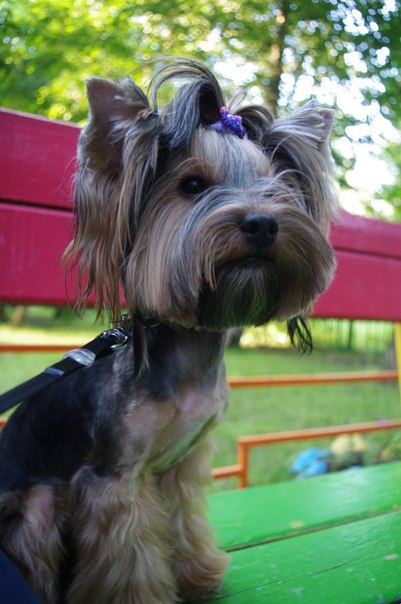

# Дмитрий Тарлыков
##  
**Возраст:** 39 лет

**Страна проживания:** Россия

**Город:** Санкт-Петербург

**Семейное положение:** женат

*Работаю руководителем управления PR в компании ["Газстройпром"](https://gsprom.ru)*

*Есть собака по кличке Тэффи*

## 

**О себе:**
- Люблю фотографировать и летать на дроне
- Обожаю путешествовать по России, если получается, то за ее пределами :)
- Хочу научиться программировать на Питоне

_Со мной можно связаться по почте [tarlykov@gmail.com](tarlykov@gmail.com)._
## Тестовая версия 3D-симулятора
- Превью из репозитория (локально): `http://localhost:8000`
- Как поднять превью: `cd yamal-bovanenkovo-sim && python3 -m http.server 8000`
- Исходники симулятора: [yamal-bovanenkovo-sim](./yamal-bovanenkovo-sim)

## Мини-игра
▶️ Играть на телефоне https://htmlpreview.github.io/?https://raw.githubusercontent.com/tarlykov1/About/main/horse-runner.html
Исходник игры: [horse-runner.html](./horse-runner.html)

## 3D-симулятор (аналогичная ссылка-превью)
▶️ Открыть превью в браузере https://htmlpreview.github.io/?https://raw.githubusercontent.com/tarlykov1/About/main/yamal-bovanenkovo-sim/index.html
Исходник симулятора: [yamal-bovanenkovo-sim/index.html](./yamal-bovanenkovo-sim/index.html)
